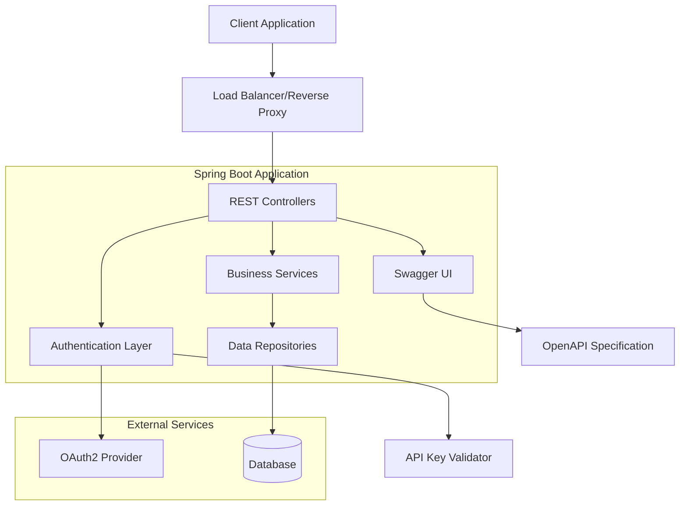

# Architecture Documentation

## Overview

The OpenAPI Petstore is a Spring Boot-based REST API implementation that serves as a reference implementation for the OpenAPI specification. The system provides a complete pet store management API with support for pets, store orders, and user management, featuring comprehensive authentication and authorization mechanisms.

## Architecture Style

The system follows a **Layered Architecture** pattern typical of Spring Boot applications, with clear separation between:
- **Presentation Layer**: REST controllers handling HTTP requests
- **Business Logic Layer**: Service components implementing business rules
- **Data Access Layer**: Repository pattern for data persistence
- **Configuration Layer**: Spring configuration and security setup

The architecture also incorporates **API-First Design** principles, with the OpenAPI specification driving the implementation.

## Key Components

### Core Components

- **Spring Boot Application**: Main application container providing dependency injection and auto-configuration
- **REST Controllers**: Handle HTTP requests and responses according to OpenAPI specification
- **Security Layer**: Implements OAuth2 and API key authentication mechanisms
- **Configuration Management**: Handles application properties and environment-specific settings
- **OpenAPI Documentation**: Provides interactive API documentation via Swagger UI

### Security Components

- **OAuth2 Authentication**: Supports implicit and password flows
- **API Key Authentication**: Simple key-based authentication for specific endpoints
- **Security Configuration**: Configurable security policies with environment-based overrides

### Infrastructure Components

- **Docker Container**: Containerized deployment with configurable base path
- **Maven Build System**: Dependency management and build automation
- **Embedded Tomcat**: Web server for handling HTTP requests

## Data Flow

## External Dependencies

### Runtime Dependencies
- **OAuth2 Provider**: External OAuth2 authorization server for token validation
- **Database System**: Persistent storage for application data (type configurable)

### Development Dependencies
- **Maven Central**: Dependency resolution and artifact management
- **Docker Hub**: Container image distribution (`openapitools/openapi-petstore`)

## Design Decisions

### 1. API-First Approach
**Decision**: Use OpenAPI specification as the source of truth for API design
**Rationale**: Ensures consistency between documentation and implementation, enables code generation, and provides clear contract definition

### 2. Flexible Authentication
**Decision**: Support multiple authentication mechanisms (OAuth2 and API keys)
**Rationale**: Accommodates different client types and security requirements while maintaining backward compatibility

### 3. Environment-Based Configuration
**Decision**: Use environment variables and Spring profiles for configuration
**Rationale**: Enables deployment flexibility across different environments without code changes

### 4. Containerized Deployment
**Decision**: Provide Docker container with configurable base path
**Rationale**: Simplifies deployment and scaling while supporting different URL structures

### 5. Security Override Capabilities
**Decision**: Allow disabling authentication via environment variables
**Rationale**: Facilitates development and testing scenarios while maintaining production security

### 6. Embedded Server Architecture
**Decision**: Use Spring Boot's embedded Tomcat server
**Rationale**: Simplifies deployment and reduces external dependencies while maintaining performance

## Configuration Points

### Application Configuration
- **Server Port**: Configurable via `server.port` (default: 8080)
- **Base Path**: Configurable via `openapi.openAPIPetstore.base-path` or `OPENAPI_BASE_PATH` environment variable
- **Security Toggles**: `DISABLE_API_KEY` and `DISABLE_OAUTH` environment variables

### Security Configuration
- **OAuth2 Credentials**: Configurable client ID, secret, and user credentials
- **API Key**: Uses `special-key` for protected endpoints
- **Flow Support**: Implicit and password OAuth2 flows

This architecture provides a robust, scalable foundation for API development while maintaining flexibility for different deployment scenarios and security requirements.